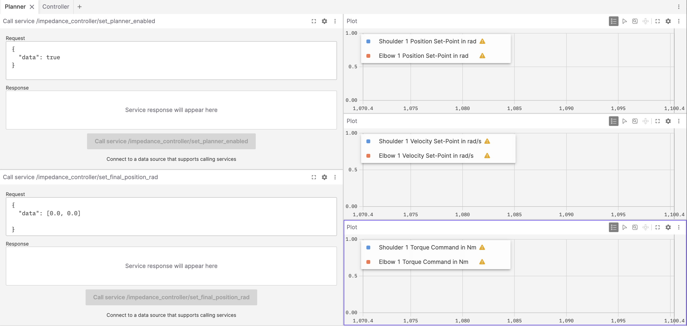
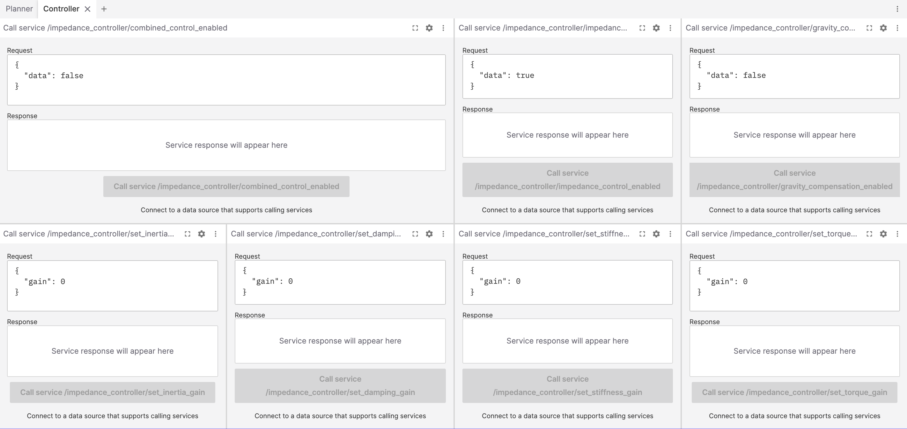

> [!WARNING]
> This package is still under development and not in a working state!

# impedance_control
This package provides an impedance controller for the robot fingers in the SeaClear2.0 grapple. It consists of a base C++ library and a ROS2 wrapper for ease of integration with the rest of the system. A Docker container with all necessary dependencies is provided for plug-and-play deployment.

## Set-Up
### FastDDS
To enable communication between the ROS2 nodes running inside the docker container and the rest of the system, a FastDDS discovery server is required. This is because the ROS2 nodes inside the container need to discover and communicate with the ROS2 nodes running on the host machine and other devices (e.g. other containers) in the network.

1. Install FastDDS on the host machine by following the instructions in the [FastDDS documentation](https://fast-dds.docs.eprosima.com/en/latest/index.html).
2. Find the IP address of the host machine:
``` bash
ip addr show
```
3. Update the IP address in the `docker/fastdds_client_profile.xml` file to match the IP address of the host machine.
4. Start the FastDDS discovery server on the host machine. Replace `192.168.2.95` with the IP address of your host machine:
``` bash
fastdds discovery -i 0 -l 192.168.2.95 -p 11815
```

### Docker
To enable easy deployment of the code, and to support different operating systems/versions, [docker](https://www.docker.com/) is used. Below is a brief guide on how to use docker for this specific application.

1. Make sure you're in the `docker` directory of the repo
``` bash
cd docker
```
2. Build the docker image using the provided Dockerfile
``` bash
docker build -t impedance_controller_ros2_image:dev .
```
3. Run the container
``` bash
docker run -it \
    --name impedance_controller_dev_container \
    --network host \
    --ipc=host \
    -e ROS_DOMAIN_ID=8 \
    -v /Users/lucas/dev/seaclear2.0/impedance-control/impedance_control/:/impedance_control \
    impedance_controller_ros2_image:dev
```
> [!NOTE]
> Remember to adjust the path `/Users/lucas/dev/seaclear2.0/impedance-control/impedance_control` when mounting the git directory depending on the file structure of your PC.

After running the container for the first time, it will persist unless explicitly removed. In future sessions, the container can be accessed by starting and executing it with the name `impedance_controller_dev_container`:

1. Start the container
``` bash
docker start impedance_controller_dev_container
```

2. Execute the container
``` bash
docker exec -it impedance_controller_dev_container /bin/bash
```

After finishing the work, you can stop the container with
``` bash
docker stop impedance_controller_dev_container
```

Always enter the docker container when developing. All the dependencies for the project are already set-up inside the container, so you don't have to worry about that.

Once you're satisfied with your work, leave the container **first** and perform the necessary git operations (add, commit, push, etc.) **second**. You may add changes inside the container, but commiting and pushing is definitely easier outside due to the complexity of SSH identification in the container.

## Usage
### Configuration
To configure the impedance controller, modify the initialization parameters in the `config.toml` file located in the `impedance_controller/` package directory. Additionally, the following parameters can be updated dynamically at runtime, either via a [GUI](#gui) or through ROS2 service calls: 
- virtual stiffness matrix,
- virtual damping matrix,
- virtual inertia matrix, and
- torque feedback gain.

> [!NOTE]
> The setters for the matrices take a scalar value and set the corresponding matrix to a scaled identity matrix. This is a common approach for tuning the controller with a single gain parameter. However, the software can be easily extended to allow setting full matrices, if needed.

### Build
To build the ROS2 workspace, run
``` bash
cd ros2_ws
source /opt/ros/humble/setup.bash
colcon build --symlink-install
```
The `--symlink-install` flag creates symbolic links to the source files instead of copying them during build. That means that changes to the source code will be reflected immediately without the need to rebuild the workspace. This is especially useful when adjusting the initialization parameters in the `config.toml` file.

### Run individual nodes
After building the code, source the ROS2 workspace with
``` bash
source install/setup.bash
```
and execute the impedance controller application with
``` bash
ros2 run impedance_controller impedance_controller_node
```
It is also possible to run the dummy planner node individually, as shown below. Look [here](#hardware-tests) for more details on this node.
``` bash
ros2 run dummy_planner dummy_planner_node
```

### Testing
#### Simulation tests
To run the simulation tests for the impedance controller, open the `matlab/` folder with your local MATLAB installation and execute the `MAIN.m` script. For more details on the simulation tests, refer to the dedicated README file in the `impedance_controller_sim/` directory.
#### Integration tests
To run the integration tests for the impedance controller, use the following command in the `ros2_ws/` directory:
``` bash
colcon test --packages-select impedance_controller
```
This will execute all the tests defined for the `impedance_controller` package. It is also possible to run the tests for a given package individually. Below is an example command to run only the `test_integration_spawn.py` test script:
``` bash
colcon test --packages-select impedance_controller --ctest-args -R test_integration_spawn
```
You can view the test results in the terminal with:
``` bash
colcon test-result --all --verbose
```
The `--verbose` flag is optional and provides more detailed output. This will generate a detailed report of the test results, including any failures or errors encountered during testing.

> [!WARNING]
> The transition to FastDDS has broken the integration tests. The quick fix is to disable FastDDS in the active shell before running the tests. To do that, unset the following environment variables:
> ``` bash
> unset FASTRTPS_DEFAULT_PROFILES_FILE
> unset ROS_DISCOVERY_SERVER
> ```
> Verify that FastDDS is disabled by running the command below. It should not return any output:
> ``` bash
> env | grep -E 'FASTRTPS_DEFAULT_PROFILES_FILE|ROS_DISCOVERY_SERVER'
> ```
### Hardware tests
To test the impedance controller in the real system, a small ROS2 package called `dummy_planner` was written to simulate the planner node and provide meaningful trajectories for the controller. It leverages trapezoidal velocity profiles to generate smooth trajectories from the current position of the fingers to a desired final position. The generated trajectories are published to the controller at a fixed rate of 100 Hz, which is the same rate at which the controller operates.

For convenience, a launch file is provided to start both the impedance controller and the dummy planner, as well as the foxglove bridge for visualization (check [this section](#gui) for more on foxglove).
``` bash
cd ros2_ws/launch
ros2 launch test_launch.yaml
```

## GUI
### Foxglove installation
Foxglove is a third-party software tool to interact with ROS2 data. It can handle recorded data e.g. via ROS bags or real time data from ROS interfaces (topics, services, actions). Here are the steps to use the impedance controller GUI based on Foxglove:
1. Install [Foxglove Studio](https://foxglove.dev/download/) on the host machine. If for some reason you can't install it, you can also use the [web version](https://studio.foxglove.dev/).
2. Go to the "Layouts" section, click on the "Add" button and select "Import Layout from File". Then, select the `impedance_controller/foxglove_layout.json` file.
3. Inside the docker container, start the ROS2 impedance controller node as described in the [Build & Run](#build--run) section.
4. Inside the docker container, start the Foxglove websocket bridge by running the following command:
``` bash
ros2 launch foxglove_bridge foxglove_bridge_launch.xml
```
5. Go back to Foxglove Studio and add a new ROS2 connection by clicking on the "Open connection" button in the "Data sources" panel.
6. Select the websocket option and set the URL to `ws://localhost:8765`. If you're using Foxglove Studio from another device, replace `localhost` with the IP address of the host machine. For example, if the local host is the Zotac and you're using Foxglove Studio on your laptop, the URL should be `ws://192.168.2.95:8765`, where `192.168.2.95` is the IP address of the Zotac.
7. Click on "Connect" to start receiving data from the impedance controller node.
### Visualization & Interaction
The provided Foxglove layout includes several panels to visualize the operation of the impedance controller and the dummy planner. It is meant **primarily** for testing and tunning of the controller, but it can also be used for monitoring the controller during deployment. The layout includes:
1. Planner tab
    - Call service `/impedance_controller/set_planner_enabled`: Enables the dummy planner to start publishing trajectories to the controller in case a desired position is provided to `/impedance_controller/set_final_position_rad`.
    - Call service `/impedance_controller/set_final_position_rad`: Sets the desired final position of the finger joints in radians. This is used by the dummy planner to generate trajectories for the controller. The expected input is a list of 2 values corresponding to the desired final position of the shoulder and elbow joints for **all fingers**, in radians.
    - Plot of `/impedance_controller/set_position_rad`: Shows the position trajectory being published by the dummy planner to the controller. To avoid clutter, only the shoulder and elbow joint positions of the first finger are plotted, but similar trajectories are published for all fingers (given that they started from the same configuration).
    - Plot of `/impedance_controller/set_velocity_rad_per_sec`: Shows the velocity trajectory being published by the dummy planner to the controller. To avoid clutter, only the shoulder and elbow joint velocities of the first finger are plotted, but similar trajectories are published for all fingers (given that they started from the same configuration).
    - Plot of `/command/set_torque_nm`: Shows the torque commands being published by the impedance controller to the motors (if enabled in the controller tab). To avoid clutter, only the shoulder and elbow joint torques of the first finger are plotted, but similar values are published for all fingers (given that they started from the same configuration).
2. Controller tab
    - Call service `/impedance_controller/combined_control_enabled`: Connects the controller to the motor drivers i.e. enables the controller to publish torque commands to the motors. This is the main "enable" switch for the controller, and it should be turned on only when the controller is properly tuned and ready to be deployed.
    - Call service `/impedance_controller/impedance_control_enabled`: Adds the impedance torque component to the controller output. This can be used to decouple the impedance control from the gravity compensation during testing.
    - Call service `/impedance_controller/gravity_compensation_enabled`: Adds the gravity compensation torque component to the controller output. This can be used to decouple the impedance control from the gravity compensation during testing.
    - Call service `/impedance_controller/set_inertia_gain`: Sets the virtual inertia gain of the controller. This is a scalar value that scales the identity matrix to create the virtual inertia matrix.
    - Call service `/impedance_controller/set_damping_gain`: Sets the virtual damping gain of the controller. This is a scalar value that scales the identity matrix to create the virtual damping matrix.
    - Call service `/impedance_controller/set_stiffness_gain`: Sets the virtual stiffness gain of the controller. This is a scalar value that scales the identity matrix to create the virtual stiffness matrix.
    - Call service `/impedance_controller/set_torque_gain`: Sets the torque gain of the controller.

<p align="center">
  
</p>

<p align="center">
  
</p>

### Typical workflow
A typical workflow for testing and tuning the impedance controller using the provided GUI is as follows:
1. Define a reasonable set of initial parameters in the `config.toml` file. This will be used as the starting point for tuning the controller.
2. Make sure that the parameters in the dummy planner align with the initial parameters in the `config.toml` file.
3. Launch the impedance controller and dummy planner using the provided launch file, as described [above](#hardware-tests). This will start the ROS2 nodes and the foxglove bridge for visualization.
4. Open the main GUI for grasping control, as specified in [Notion](https://www.notion.so/Launch-documentation-254c83f6d90880e5a549da8c06db0dab?source=copy_link#265c83f6d9088073b2cbc1ba81526a16). You will need to enable torque control for the motors.
5. Navigate to the planner tab in the foxglove GUI and enable the planner.
6. Navigate to the controller tab in the foxglove GUI and enable the torque components that you want to test, e.g., gravity compensation, impedance control, etc.
7. Still in the controller tab, enable the combined control to start sending messages to the motors.
8. Navigate back to the planner tab and set a desired final position for the fingers. This will trigger the dummy planner to generate trajectories for the controller, which will start moving the fingers accordingly.
9. Adjust the impedance control parameters in the controller tab and repeat the earlier steps to tune the controller and achieve the desired impedance behaviour.

> [!WARNING]
> When tuning the impedance controller, always be cautious and have the emergency stop button readily available in the main GUI.

## Documentation
### Doxygen
The implementation of the impedance controller is documented using Doxygen. To generate the documentation, navigate to the `docs/` directory and run:
```bash
doxygen Doxyfile
```
The generated documentation will be available in the `docs/html` directory. Alternatively, you can compile and view the `.pdf` documentation directly by navigating to `docs/latex` and running:
```bash
make
```
The resulting `refman.pdf` file contains the complete documentation.

> [!NOTE]
> To keep the docker container lightweight, LaTeX is not installed. If you want to generate the `.pdf` documentation, you can do it on your local machine with a LaTeX installation (e.g. TeX Live, MiKTeX, etc.) by following the instructions above.

### Developer Notes
For more information on the impedance control algorithm, refer to the [developer notes](https://sharelatex.tum.de/project/694488e4bccf9df893153f9d). The latest version is also available in the `docs/` directory.

## Contact
For questions or support regarding the impedance controller, please contact the SeaClear2.0 development team at lucasmo.silva@tum.de.