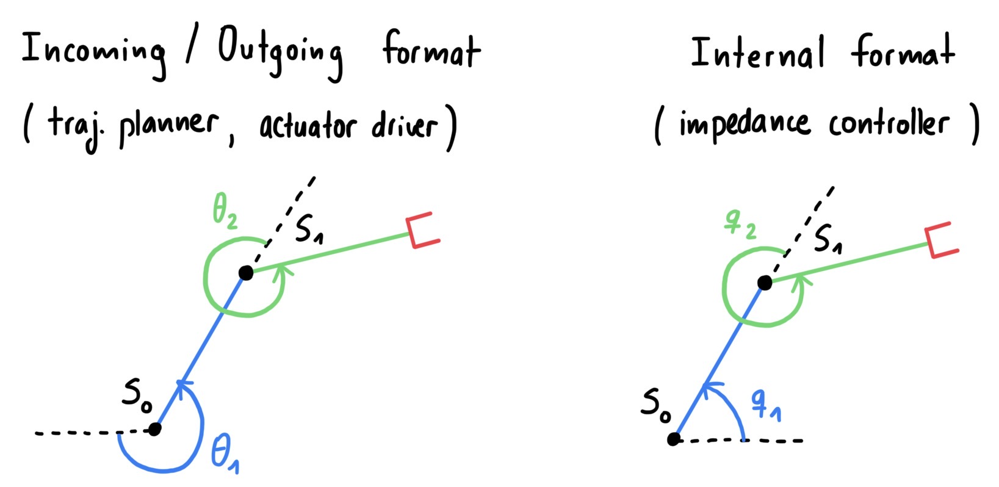

# impedance_controller package

## Coordinate Transformations
The impedance controller has two main interfaces:
1. The trajectory planner
2. The actuator driver

Both interfaces use the same coordinate system for the joints of the robot, however, it is not the same as the DH convention (used here). Thus, a transformation is needed. Below are drawings illustrating both coordinate frame definitions:

  

