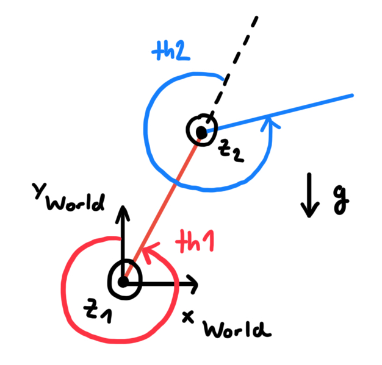

# Simulation
We use a MATLAB model to test the impedance controller. It is provided by Matthew Sheen and can be found on the [MATLAB File Exchange](https://de.mathworks.com/matlabcentral/fileexchange/57853-impedance-control-for-a-2-link-robot-arm-user-interactive). The simulation framework comes with a pre-implemented impedance controller, which we adapted to run with our own version as well.

The MATLAB model is not designed to run in a docker container, to avoid a local installation of MATLAB and to keep the container lightweight for deployment. To use the simulation, you will need to have MATLAB installed on your machine and update the MATLAB path and OS architecture in the `CMakeLists.txt` file as needed.

Instead of re-implementing the entire impedance controller in MATLAB, we have created a MEX function that allows us to call our C++ implementation of the impedance controller directly from MATLAB. This Software-in-the-Loop (SIL) approach enables us to test the exact C++ code that will be used in the real robot, without running the risk of any translation errors from C++ to MATLAB and vice-versa.

# Usage
## Configuration
The entrypoint file is `MAIN.m`. In this file you can select which controller to use (MATLAB or C++). To do that, simply set the `implementation_toggle` variable to `true` (MATLAB) or `false` (C++) as needed. It was also modified to use our custom forward kinematiocs when the toggle is set to `false`.

The `FullDyn.m` file was modified to switch between both controllers. For details on how to call the mex functions, please refer to the comments on the source code in `mex/`.

## Build & Run
To build the MEX function required for the C++ implementation, first create the `build/` directory (if not done already) and navigate into it. Then, configure CMake and build the project:
```bash
mkdir -p build
cd build
cmake ..
make
```

After building the MEX function, you can run the simulation by executing the `MAIN.m` file in MATLAB. This will launch the simulation and allow you to interact with it using the provided GUI.

Clicking with the mouse allows the user to change the desired position of the end-effector. Pressing any key will make it so that clicking on the plot now applies an external force to the end-effector. The direction of the force vector and its magnitude are determined by the position of the mouse click relative to the end-effector's current position. The further away from the end-effector, the stronger the applied force will be. For further details on the user interaction, please refer to the original documentation.

# Miscellaneous
## Note 1: Joint Angle Definition
The joint angles in the simulation are defined as follows. We must transform them to the DH-convention before using our controller.
<p align="center">
  
</p>

## Note 2: C++ Architecture
The C++ mex functions used for the simulation interface employ an older architecture w/o the `CombinedController` class. That means the gravity compensation is manually added to the impedance controller torque in the MATLAB code instead.